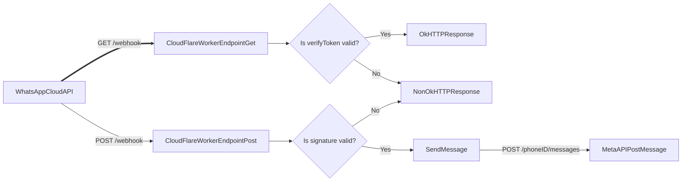

# Translator Bot

This [CloudFlare Worker](https://developers.cloudflare.com/workers/) implements a WhatsApp bot that can help you to learn some new words in different languages.

The architecture of this solution looks like this:

The worker itself tries to do as less as possible and uses the following libraries:

- [packages/whatsapp](/packages/whatsapp/) to receive and send whats messages.

## Features

The bot can:

- Receive a message and say hi :wave: back :tada:
- For now that would be it :smiley:
